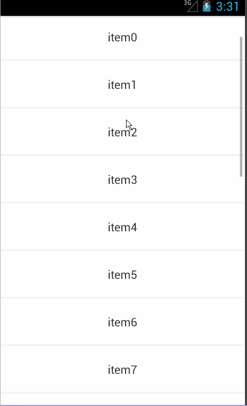

# Android-PullToRefreshAndLoad
用简单的代码实现下拉刷新和上拉加载更多

## 1. 效果图

## 2. 使用示范

2.1 使用自定义控件

	<com.example.pulltorefreshandload.RefreshListView
        android:id="@+id/refresh_listview"
        android:layout_width="match_parent"
        android:layout_height="match_parent" />

> 

2.2 MainActivity

	public class MainActivity extends Activity
	{
	
		private List<String> mData;
		private RefreshListView mRefreshListView;
	
		@Override
		protected void onCreate(Bundle savedInstanceState) {
			super.onCreate(savedInstanceState);
			requestWindowFeature(Window.FEATURE_NO_TITLE);
			setContentView(R.layout.activity_main);
	
			mRefreshListView = (RefreshListView) findViewById(R.id.refresh_listview);
	
			// 初始化数据
			mData = new ArrayList<String>();
			for (int i = 0; i < 20; i++) {
				mData.add("item" + i);
			}
	
			// 设置允许用户下拉刷新和上拉加载更多
			mRefreshListView.setEnablePullRefresh(true);
	
			// 设置适配器
			ArrayAdapter<String> adapter = new ArrayAdapter<String>(this, R.layout.list_item, mData);
			mRefreshListView.setAdapter(adapter);
	
			// 设置监听
			mRefreshListView.setOnRefreshOrLoadMoreListener(new OnRefreshOrLoadMoreListener() {
	
				@Override
				public void refresh() {//下拉刷新
					new Thread(new Runnable() {
						public void run() {
							// 下拉刷新的操作
							SystemClock.sleep(3000);
							MainActivity.this.runOnUiThread(new Runnable() {
								public void run() {
									// 刷新完成后隐藏下拉或上拉控件
									mRefreshListView.refreshOrLoadMoreFinish();
								}
							});
						}
					}).start();
				}
	
				@Override
				public void loadMore() {//上拉加载更多
					new Thread(new Runnable() {
						public void run() {
							// 上拉加载更多的操作
							SystemClock.sleep(3000);
							MainActivity.this.runOnUiThread(new Runnable() {
								public void run() {
									// 刷新完成后隐藏下拉或上拉控件
									mRefreshListView.refreshOrLoadMoreFinish();
								}
							});
						}
					}).start();
				}
			});
		}
	}
